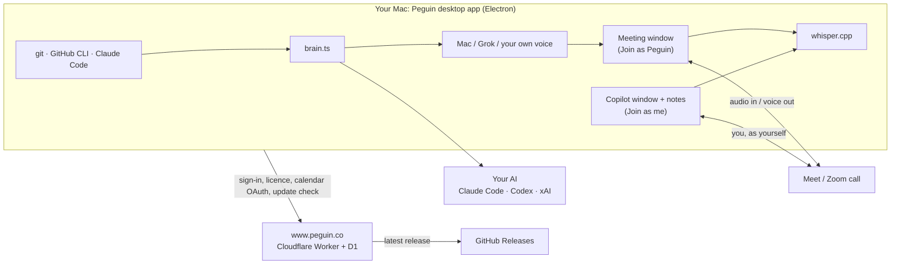

# Peguin

Peguin is an AI standup assistant for the Mac. It writes your update from what you actually worked on, joins your standup on Google Meet or Zoom as "<your name> (AI)", waits until someone hands you the floor, says it's an AI, gives your update out loud and answers short follow-ups from your notes only. When you'd rather be in the call yourself, its private copilot listens alongside you and suggests answers that only you see.

Website and accounts: [www.peguin.co](https://www.peguin.co). Working on this with a coding agent? Start with [AGENTS.md](AGENTS.md). Each feature, its decisions and its files: [docs/features/](docs/features/README.md).

## What's built

**Join as Peguin** ([ai-participant](docs/features/ai-participant.md))
- A hidden Chromium window joins as a guest, muted until it speaks. Peguin listens, decides with a rule-based turn detector when it's been called on, and gives the update, which was prepared and voiced before the meeting so it starts instantly.
- Follow-ups are answered only from the prepared facts; anything else is deferred to you. Answers are spoken a sentence at a time, and Peguin stops when someone talks over it.
- It always discloses that it's an AI first, and its name ends in "(AI)".
- **Hand over to me** opens the meeting in your browser while Peguin tells the room and leaves.

**Join as me: the private copilot** ([copilot](docs/features/copilot.md))
- You join your own meeting, as yourself, in a Peguin window. Peguin hears only the other participants, transcribes on your Mac, and when someone asks you something it suggests an answer in a panel that isn't sent to the call.
- Answers are labelled **From your notes**, **Not in your notes** or **General knowledge**. It never invents your status, numbers or experience.
- **Work / Interview** switch, **Check online** (a web-searched second answer for general questions), **Hide**, and **Pop out** (the notes in their own window, so you can share the meeting window or any other window without them).

**Writing the update** ([update-drafting](docs/features/update-drafting.md))
- From local git commits, your PRs through the GitHub CLI, and (opt-in) your own prompts in Claude Code. No extra logins. Prepared 15 minutes before the standup.

**Your own AI** ([your-ai](docs/features/your-ai.md))
- Drafts, answers, copilot suggestions and recap summaries run on the AI you choose in Settings: **Claude** (your Claude Code sign-in), **Codex** (your ChatGPT sign-in) or **Grok** (your xAI key, kept encrypted). Peguin's server never sees your work or meeting text.

**Hearing and speaking** ([speech-recognition](docs/features/speech-recognition.md), [voice](docs/features/voice.md))
- whisper.cpp large-v3-turbo on the Mac, primed with your names and the terms in your notes.
- Standard voice: the Mac's, or a Grok voice. Or, opt-in, **your own voice**, from a sample recorded live with a consent sentence: on the Mac (Chatterbox Turbo) or through your ElevenLabs account. Prepared lines are checked by ear and redone if a word comes out wrong.

**Calendars** ([calendars](docs/features/calendars.md))
- Finds standups by your own words in the Mac's Calendar, Google Calendar, Outlook, Calendly or iCal links, and joins them automatically. Or a fixed time.

**Recaps** ([recaps](docs/features/recaps.md))
- After each meeting: follow-ups first (every deferred question), an optional summary, what Peguin said and the transcript. Encrypted on your Mac, kept 30 days by default.

**Accounts, plans and updates** ([accounts-and-billing](docs/features/accounts-and-billing.md), [updates-and-releases](docs/features/updates-and-releases.md))
- Email-link or Google sign-in on the website; the app signs in through the browser. Free, Basic, Pro and Team plans (Pro trial for 14 days, no card), Paystack billing, licences checked offline.
- The app updates itself: it downloads the new release, checks its checksum and offers "Restart to update".

**Website** ([website](docs/features/website.md))
- Landing page with a scripted app demo, pricing, account page, Privacy Policy and Terms, and a help penguin whose chat answers from the FAQ and hands off to the team.

## How it fits together



Everything about your work and your meetings stays on your Mac or goes only to the AI you picked. The Worker handles accounts, billing, licences, calendar sign-in hand-off, the website and the help chat.

## Repository

```
desktop/     the Mac app: main process (desktop/src/main), React UI (desktop/src/renderer), injected meeting scripts (desktop/resources)
cloud/       Cloudflare Worker + D1: accounts, Paystack, licences, calendar OAuth, releases, help chat; serves web/dist
web/         the website (React + Vite)
src/         shared code (prompts, turn-taking, plans) and the original server stack, kept as optional adapters
test/        vitest suites for all of the above
docs/        ARCHITECTURE, DECISIONS, STATUS, RELEASING, OAUTH_SETUP, features/
spikes/      throwaway experiments (voice research lives here)
```

## Run it

```bash
npm install
cd desktop && npm install
npm run setup:whisper   # once: builds whisper.cpp into desktop/vendor
npm run dev             # the app with hot reload
```

The website and Worker locally: `cd cloud && npm install && npx wrangler dev` (the app talks to it unless `PENGUIN_CLOUD_URL` is set). Checks before any change: `npm run typecheck && npm test` at the root, and `npm run typecheck` in `desktop/`.

Releases: `npm run release -- patch|minor|major` on an up-to-date `main`, then `git push origin main --follow-tags`. GitHub Actions builds the .dmg and zip, the site offers them, and installed apps update themselves. The Worker and website deploy automatically after CI passes on `main`. Details in [docs/RELEASING.md](docs/RELEASING.md).

## Status

Private beta, macOS on Apple silicon. Not yet: Teams (needs Azure Communication Services), Windows, Apple Developer ID signing (macOS asks to confirm on first open), Slack recaps, team seats, Linear and Jira on the desktop. What's verified and what's next: [docs/STATUS.md](docs/STATUS.md).

## The original server stack

Peguin started as a hosted service: a meeting-bot vendor (Recall.ai or Attendee) in the call, Deepgram for speech, BullMQ workers, Postgres and Redis. It's kept in `src/` as optional adapters. How to run it and its API: [docs/features/server-stack.md](docs/features/server-stack.md).
